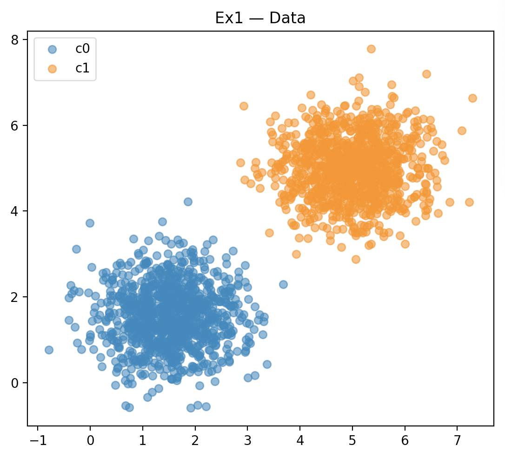
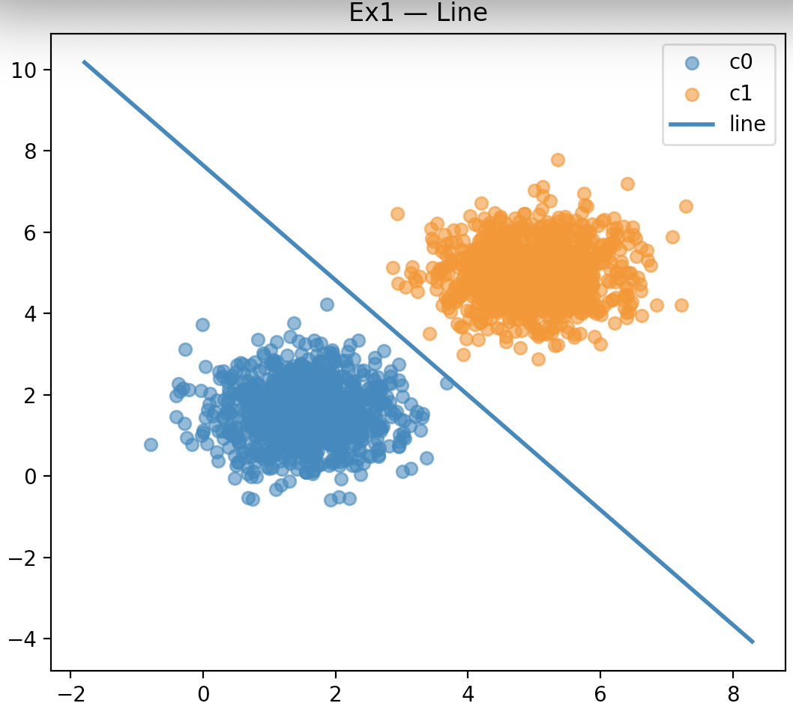
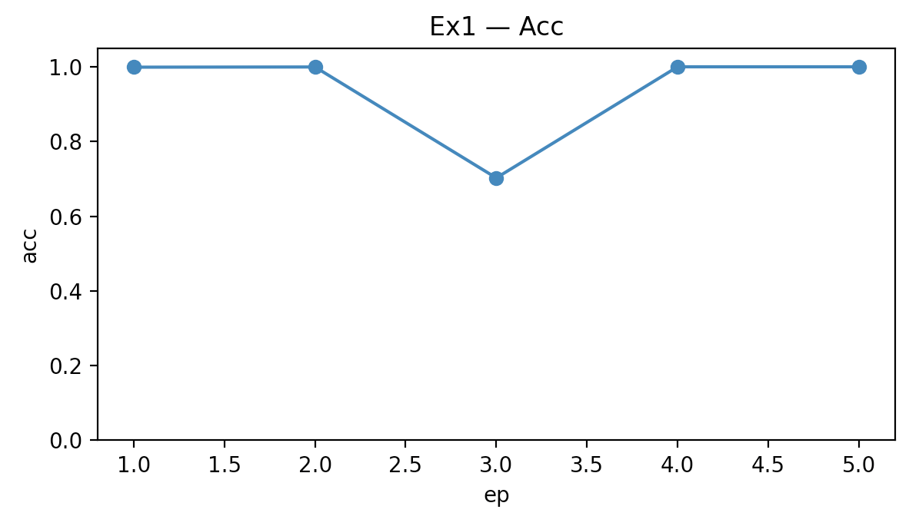
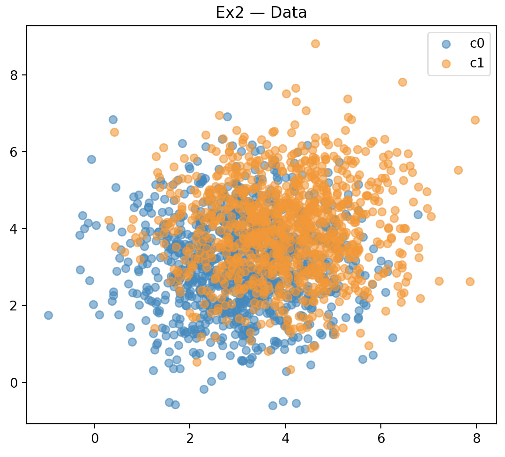
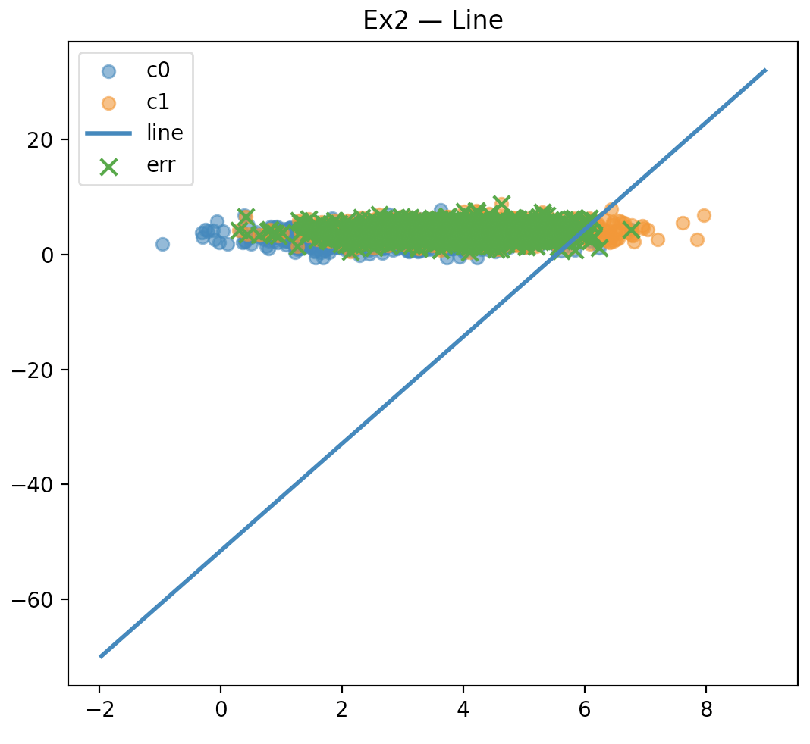
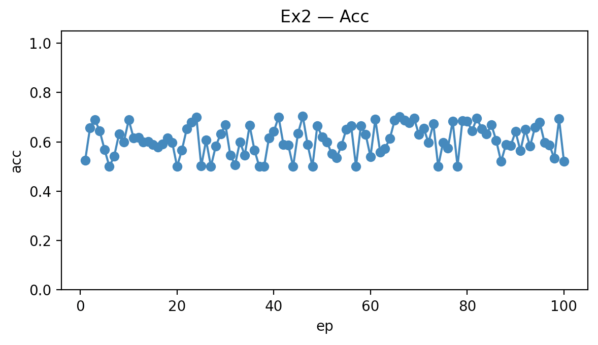

# Deep Learning — Atividade 2

## Exercício 1 — Perceptron com Dados Linearmente Separáveis

**Objetivo.** Criar duas classes 2D bem separadas e treinar um perceptron do zero para achar a linha de decisão.

**O que eu fiz**
- Gerei 1000 pontos por classe com numpy.random.multivariate_normal.
- Parâmetros: m0=[1.5, 1.5], m1=[5, 5], e covariâncias [[0.5,0],[0,0.5]] para ambas.
- Treinei um perceptron (η=0.01) por até 100 épocas, salvando acurácia a cada época.
- Plotei: dados, linha de decisão e curva de acurácia.

**O que aconteceu**
- Convergência rápida: parou em 5 épocas.
- Linha de decisão separou tudo sem erro.
- Acurácia final = 100%, confirmando que, com separabilidade linear, o perceptron converge.


```python
import numpy as np
import matplotlib.pyplot as plt

np.random.seed(42)

m0 = np.array([1.5, 1.5])
c0 = np.array([[0.5, 0.0], [0.0, 0.5]])

m1 = np.array([5.0, 5.0])
c1 = np.array([[0.5, 0.0], [0.0, 0.5]])

n = 1000

x0 = np.random.multivariate_normal(m0, c0, n)
x1 = np.random.multivariate_normal(m1, c1, n)

y0 = -np.ones(n)
y1 = +np.ones(n)

X = np.vstack([x0, x1])
y = np.concatenate([y0, y1])

plt.figure(figsize=(5.5, 5))
plt.scatter(x0[:,0], x0[:,1], alpha=0.6, label="c0")
plt.scatter(x1[:,0], x1[:,1], alpha=0.6, label="c1")
plt.title("Ex1 — Data")
plt.legend()
plt.tight_layout()

class Perceptron:
    def __init__(self, lr=1e-2, ep=100, shuffle=True):
        self.lr = lr
        self.ep = ep
        self.shuffle = shuffle
        self.w = None
        self.b = None

    def fit(self, X, y):
        n, d = X.shape
        self.w = np.zeros(d)
        self.b = 0.0

        ep_hist = []
        acc_hist = []
        upd_hist = []

        idx = np.arange(n)
        for e in range(1, self.ep + 1):
            if self.shuffle:
                np.random.shuffle(idx)

            upd = 0
            for i in idx:
                xi, yi = X[i], y[i]
                s = np.dot(self.w, xi) + self.b
                yh = 1.0 if s >= 0.0 else -1.0
                if yh != yi:
                    self.w += self.lr * yi * xi
                    self.b += self.lr * yi
                    upd += 1

            p = self.predict(X)
            acc = (p == y).mean()

            ep_hist.append(e)
            acc_hist.append(acc)
            upd_hist.append(upd)

            if upd == 0:
                break

        return {"ep": ep_hist, "acc": acc_hist, "upd": upd_hist}

    def f(self, X):
        return X @ self.w + self.b

    def predict(self, X):
        return np.where(self.f(X) >= 0.0, 1.0, -1.0)

model = Perceptron(lr=1e-2, ep=100, shuffle=True)
hist = model.fit(X, y)

p = model.predict(X)
acc = (p == y).mean()

print("w:", model.w)
print("b:", model.b)
print(f"acc: {acc:.4f}")
print(f"ep: {len(hist['ep'])}; last upd: {hist['upd'][-1] if hist['upd'] else 'n/a'}")

plt.figure(figsize=(5.5, 5))
plt.scatter(X[y==-1,0], X[y==-1,1], alpha=0.6, label="c0")
plt.scatter(X[y== 1,0], X[y== 1,1], alpha=0.6, label="c1")

if model.w is not None and abs(model.w[1]) > 1e-12:
    x_min, x_max = X[:,0].min()-1, X[:,0].max()+1
    xs = np.linspace(x_min, x_max, 300)
    ys_line = (-model.b - model.w[0]*xs) / model.w[1]
    plt.plot(xs, ys_line, linewidth=2, label="line")

mis = p != y
if mis.any():
    plt.scatter(X[mis,0], X[mis,1], marker='x', s=60, label="err")

plt.title("Ex1 — Line")
plt.legend()
plt.tight_layout()

plt.figure(figsize=(6, 3.5))
plt.plot(hist["ep"], hist["acc"], marker='o')
plt.xlabel("ep")
plt.ylabel("acc")
plt.ylim(0.0, 1.05)
plt.title("Ex1 — Acc")
plt.tight_layout()

plt.show()

```

**Dados**
w: [0.05543357 0.03926111]
b: -0.3000000000000001
acc: 1.0000
ep: 5; last upd: 0

**Imagens**
-   
-   
-   

---

## Exercício 2 — Perceptron com Dados Sobrepostos

**Objetivo.** Criar duas classes de pontos em 2D que se misturam bastante e observar como o perceptron se comporta nesse cenário.

**O que eu fiz**
- Gerei 1000 pontos por classe com m0=[3,3], m1=[4,4] e covariâncias [[1.5,0],[0,1.5]].
- Treinei o mesmo perceptron do exercício anterior, por até 100 épocas.
- Plotei os dados, a linha de decisão aprendida e a acurácia por época.

**O que aconteceu**
- O perceptron não convergiu: mesmo na última época ainda fazia centenas de atualizações.
- A acurácia ficou em torno de 52.15%.
- A linha de decisão não consegue separar todos os pontos, porque existe muita sobreposição entre as classes.
- Isso mostra a limitação do perceptron clássico: ele só garante convergência perfeita quando os dados são realmente separáveis por uma linha.

```python
import numpy as np
import matplotlib.pyplot as plt

np.random.seed(42)

m0 = np.array([3.0, 3.0])
c0 = np.array([[1.5, 0.0], [0.0, 1.5]])

m1 = np.array([4.0, 4.0])
c1 = np.array([[1.5, 0.0], [0.0, 1.5]])

n = 1000

x0 = np.random.multivariate_normal(m0, c0, n)
x1 = np.random.multivariate_normal(m1, c1, n)

y0 = -np.ones(n)
y1 = +np.ones(n)

X = np.vstack([x0, x1])
y = np.concatenate([y0, y1])

plt.figure(figsize=(5.5, 5))
plt.scatter(x0[:,0], x0[:,1], alpha=0.6, label="c0")
plt.scatter(x1[:,0], x1[:,1], alpha=0.6, label="c1")
plt.title("Ex2 — Data")
plt.legend()
plt.tight_layout()

class Perceptron:
    def __init__(self, lr=1e-2, ep=100, shuffle=True):
        self.lr = lr
        self.ep = ep
        self.shuffle = shuffle
        self.w = None
        self.b = None

    def fit(self, X, y):
        n, d = X.shape
        self.w = np.zeros(d)
        self.b = 0.0

        ep_hist, acc_hist, upd_hist = [], [], []

        idx = np.arange(n)
        for e in range(1, self.ep + 1):
            if self.shuffle:
                np.random.shuffle(idx)

            upd = 0
            for i in idx:
                xi, yi = X[i], y[i]
                s = np.dot(self.w, xi) + self.b
                yh = 1.0 if s >= 0.0 else -1.0
                if yh != yi:
                    self.w += self.lr * yi * xi
                    self.b += self.lr * yi
                    upd += 1

            p = self.predict(X)
            acc = (p == y).mean()

            ep_hist.append(e)
            acc_hist.append(acc)
            upd_hist.append(upd)

            if upd == 0:
                break

        return {"ep": ep_hist, "acc": acc_hist, "upd": upd_hist}

    def f(self, X):
        return X @ self.w + self.b

    def predict(self, X):
        return np.where(self.f(X) >= 0.0, 1.0, -1.0)

model = Perceptron(lr=1e-2, ep=100, shuffle=True)
hist = model.fit(X, y)

p = model.predict(X)
acc = (p == y).mean()

print("w:", model.w)
print("b:", model.b)
print(f"acc: {acc:.4f}")
print(f"ep: {len(hist['ep'])}; last upd: {hist['upd'][-1] if hist['upd'] else 'n/a'}")

plt.figure(figsize=(5.5, 5))
plt.scatter(X[y==-1,0], X[y==-1,1], alpha=0.6, label="c0")
plt.scatter(X[y== 1,0], X[y== 1,1], alpha=0.6, label="c1")

if model.w is not None and abs(model.w[1]) > 1e-12:
    x_min, x_max = X[:,0].min()-1, X[:,0].max()+1
    xs = np.linspace(x_min, x_max, 300)
    ys_line = (-model.b - model.w[0]*xs) / model.w[1]
    plt.plot(xs, ys_line, linewidth=2, label="line")

mis = p != y
if mis.any():
    plt.scatter(X[mis,0], X[mis,1], marker='x', s=60, label="err")

plt.title("Ex2 — Line")
plt.legend()
plt.tight_layout()

plt.figure(figsize=(6, 3.5))
plt.plot(hist["ep"], hist["acc"], marker='o')
plt.xlabel("ep")
plt.ylabel("acc")
plt.ylim(0.0, 1.05)
plt.title("Ex2 — Acc")
plt.tight_layout()

plt.show()


```


**Dados**
w: [ 0.07943405 -0.00853928]
b: -0.44000000000000017
acc: 0.5215
ep: 100; last upd: 776

**Imagens**
-   
-   
-   

---

### Resumindo
- **Ex1:** dados separáveis ⇒ perceptron converge rápido e atinge 100% de acerto.  
- **Ex2:** dados sobrepostos ⇒ perceptron não converge; acurácia estabiliza baixa (~52%) e a reta pode ficar com inclinação gigante, refletindo a limitação do modelo linear.