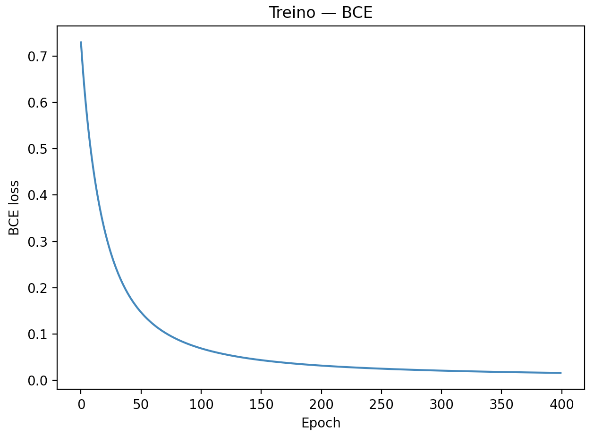
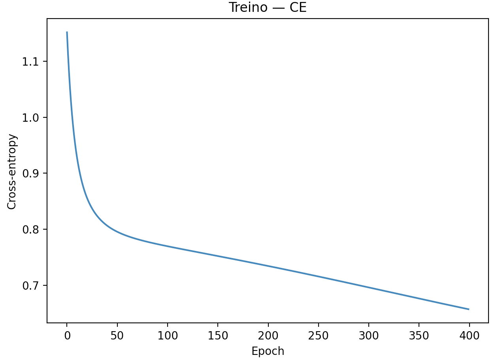
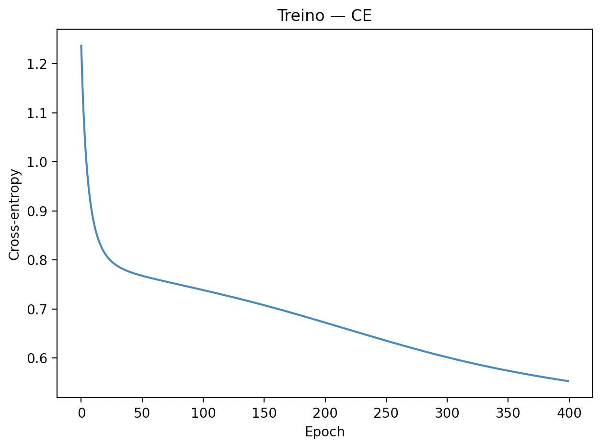

# Deep Learning — Atividade MLP

## Exercício 1

**Objetivo.** Mostrar, na prática, como funciona um MLP 2–2–1 com `tanh` e MSE em um único exemplo: fazer o forward, calcular a loss, voltar com o backward para obter os gradientes e, por fim, atualizar os pesos (um passo de aprendizado).

**O que eu fiz**
- Fixei x, y e os pesos/bias exatamente como no enunciado.
- Deixei todas as contas explícitas no código e registrei os valores finais para conferência.

**O que aconteceu**
- O forward e a loss saíram como esperado para esses parâmetros.
- Os gradientes ficaram consistentes e, após um único passo de atualização, os pesos/bias mudaram na direção certa, confirmando que o backprop e a regra de atualização estão corretos.


**Dados**
- ENTRADAS
x:
 [[ 0.5]
 [-0.2]]
y: 1.0

- PARÂMETROS (iniciais)
W1:
 [[ 0.3 -0.1]
 [ 0.2  0.4]]
b1:
 [[ 0.1]
 [-0.2]]
W2:
 [[ 0.5 -0.3]]
b2:
 [[0.2]]

- FORWARD (propagação)
z1:
 [[ 0.27]
 [-0.18]]
h1 = tanh(z1):
 [[ 0.2636248355]
 [-0.1780808681]]
u2 = W2@h1 + b2:
 [[0.3852366782]]
yhat = tanh(u2): 0.367246562645108

- LOSS
L = (y - yhat)^2: 0.4003769124844312

- gradientes
dL/dyhat: -1.265506874709784
dL/du2: -1.0948279147135995
dW2:
 [[-0.2886238289  0.1949679055]]
db2:
 [[-1.0948279147]]
dL/dh1:
 [[-0.5474139574]
 [ 0.3284483744]]
dL/dz1:
 [[-0.5093697527]
 [ 0.3180323583]]
dW1:
 [[-0.2546848763  0.1018739505]
 [ 0.1590161791 -0.0636064717]]
db1:
 [[-0.5093697527]
 [ 0.3180323583]]

- PARÂMETROS ATUALIZADOS (eta = 0.1)
W2_novo:
 [[ 0.5288623829 -0.3194967905]]
b2_novo:
 [[0.3094827915]]
W1_novo:
 [[ 0.3254684876 -0.1101873951]
 [ 0.1840983821  0.4063606472]]
b1_novo:
 [[ 0.1509369753]
 [-0.2318032358]]


---

## Exercício 2

```python

import numpy as np
import matplotlib.pyplot as plt
from sklearn.datasets import make_classification

total = 1000
n0 = total // 2
n1 = total - n0

X0_all, y0_all = make_classification(
    n_samples=total, n_features=2, n_informative=2, n_redundant=0,
    n_classes=2, n_clusters_per_class=1, flip_y=0.0, class_sep=1.5,
    random_state=42
)
X0 = X0_all[y0_all == 0][:n0]
y0 = np.zeros((len(X0), 1), dtype=int)

X1_all, y1_all = make_classification(
    n_samples=total, n_features=2, n_informative=2, n_redundant=0,
    n_classes=2, n_clusters_per_class=2, flip_y=0.0, class_sep=1.5,
    random_state=42
)
X1 = X1_all[y1_all == 1][:n1]
y1 = np.ones((len(X1), 1), dtype=int)

X = np.vstack([X0, X1]).astype(np.float64)
y = np.vstack([y0, y1])

rng = np.random.default_rng(42)
perm = rng.permutation(len(X))
X, y = X[perm], y[perm]

n_train = int(0.8 * len(X))
X_train, y_train = X[:n_train], y[:n_train]
X_test,  y_test  = X[n_train:], y[n_train:]

mu = X_train.mean(axis=0)
sd = X_train.std(axis=0) + 1e-9
X_train = (X_train - mu) / sd
X_test  = (X_test  - mu) / sd

hidden_units = 8
epochs = 400
lr = 0.1

rng = np.random.default_rng(1)
W1 = rng.normal(0.0, np.sqrt(1.0 / X_train.shape[1]), size=(X_train.shape[1], hidden_units))
b1 = np.zeros((1, hidden_units))
W2 = rng.normal(0.0, np.sqrt(1.0 / hidden_units), size=(hidden_units, 1))
b2 = np.zeros((1, 1))

def sigmoid(z):
    return 1.0 / (1.0 + np.exp(-z))

loss_history = []
N = len(X_train)

for ep in range(1, epochs + 1):
    z1 = X_train @ W1 + b1
    h1 = np.tanh(z1)
    z2 = h1 @ W2 + b2
    y_prob = sigmoid(z2)
    eps = 1e-12
    p = np.clip(y_prob, eps, 1 - eps)
    loss = -np.mean(y_train * np.log(p) + (1 - y_train) * np.log(1 - p))
    loss_history.append(loss)
    dz2 = (y_prob - y_train) / N
    dW2 = h1.T @ dz2
    db2 = np.sum(dz2, axis=0, keepdims=True)
    dh1 = dz2 @ W2.T
    dz1 = dh1 * (1.0 - h1**2)
    dW1 = X_train.T @ dz1
    db1 = np.sum(dz1, axis=0, keepdims=True)
    W2 -= lr * dW2
    b2 -= lr * db2
    W1 -= lr * dW1
    b1 -= lr * db1
    if ep == 1 or ep % max(1, epochs // 10) == 0:
        acc_train = ((y_prob >= 0.5).astype(int) == y_train).mean()
        print(f"epoch {ep:4d} | loss {loss:.4f} | acc {acc_train:.3f}")

h1_test = np.tanh(X_test @ W1 + b1)
y_prob_test = sigmoid(h1_test @ W2 + b2)

acc_train = ((y_prob >= 0.5).astype(int) == y_train).mean()
acc_test  = ((y_prob_test >= 0.5).astype(int) == y_test).mean()

print(f"treino: {acc_train:.3f}")
print(f"teste: {acc_test:.3f}")

plt.figure()
plt.plot(loss_history)
plt.xlabel("Epoch")
plt.ylabel("BCE loss")
plt.title("Treino — BCE")
plt.tight_layout()
plt.show()

```

**Dados:**
epoch    1 | loss 0.7298 | acc 0.203
epoch   40 | loss 0.1874 | acc 0.991
epoch   80 | loss 0.0898 | acc 0.994
epoch  120 | loss 0.0566 | acc 0.996
epoch  160 | loss 0.0408 | acc 0.998
epoch  200 | loss 0.0319 | acc 0.998
epoch  240 | loss 0.0263 | acc 0.998
epoch  280 | loss 0.0225 | acc 0.998
epoch  320 | loss 0.0197 | acc 0.998
epoch  360 | loss 0.0176 | acc 0.998
epoch  400 | loss 0.0160 | acc 0.998
- treino: 0.998
- teste: 1.000


**Imagem:**


---

## Exercício 3 — MLP Multiclasse (3 classes, 4 features, 2–3–4 clusters)

```python
import numpy as np
import matplotlib.pyplot as plt
from sklearn.datasets import make_classification

total = 1500
por_classe = total // 3

# classe 0 com 2 clusters
X0_all, y0_all = make_classification(
    n_samples=total, n_features=4, n_informative=4, n_redundant=0,
    n_classes=3, n_clusters_per_class=2, random_state=42
)
X0 = X0_all[y0_all == 0][:por_classe]
y0 = np.zeros((len(X0), 1), dtype=int)

# classe 1 com 3 clusters
X1_all, y1_all = make_classification(
    n_samples=total, n_features=4, n_informative=4, n_redundant=0,
    n_classes=3, n_clusters_per_class=3, random_state=42
)
X1 = X1_all[y1_all == 1][:por_classe]
y1 = np.ones((len(X1), 1), dtype=int)

# classe 2 com 4 clusters
X2_all, y2_all = make_classification(
    n_samples=total, n_features=4, n_informative=4, n_redundant=0,
    n_classes=3, n_clusters_per_class=4, random_state=42
)
X2 = X2_all[y2_all == 2][:por_classe]
y2 = 2*np.ones((len(X2), 1), dtype=int)

X = np.vstack([X0, X1, X2]).astype(np.float64)
y = np.vstack([y0, y1, y2])

rng = np.random.default_rng(42)
perm = rng.permutation(len(X))
X, y = X[perm], y[perm]

n_train = int(0.8 * len(X))
X_train, y_train = X[:n_train], y[:n_train].ravel()
X_test,  y_test  = X[n_train:], y[n_train:].ravel()

mu = X_train.mean(axis=0)
sd = X_train.std(axis=0) + 1e-9
X_train = (X_train - mu) / sd
X_test  = (X_test  - mu) / sd

C = 3
def one_hot(y, C):
    Y = np.zeros((y.shape[0], C), dtype=float)
    Y[np.arange(y.shape[0]), y] = 1.0
    return Y
Y_train = one_hot(y_train, C)

hidden_units = 16
epochs = 400
lr = 0.1

rng = np.random.default_rng(1)
W1 = rng.normal(0.0, np.sqrt(1.0 / X_train.shape[1]), size=(X_train.shape[1], hidden_units))
b1 = np.zeros((1, hidden_units))
W2 = rng.normal(0.0, np.sqrt(1.0 / hidden_units), size=(hidden_units, C))
b2 = np.zeros((1, C))

def softmax(z):
    z = z - z.max(axis=1, keepdims=True)
    e = np.exp(z)
    return e / e.sum(axis=1, keepdims=True)

loss_hist = []
N = len(X_train)

for ep in range(1, epochs + 1):
    z1 = X_train @ W1 + b1
    h1 = np.tanh(z1)
    z2 = h1 @ W2 + b2
    P = softmax(z2)

    eps = 1e-12
    loss = -np.mean(np.sum(one_hot(y_train, C) * np.log(P + eps), axis=1))
    loss_hist.append(loss)

    dZ2 = (P - Y_train) / N
    dW2 = h1.T @ dZ2
    db2 = np.sum(dZ2, axis=0, keepdims=True)

    dH1 = dZ2 @ W2.T
    dZ1 = dH1 * (1.0 - h1**2)
    dW1 = X_train.T @ dZ1
    db1 = np.sum(dZ1, axis=0, keepdims=True)

    W2 -= lr * dW2
    b2 -= lr * db2
    W1 -= lr * dW1
    b1 -= lr * db1

    if ep == 1 or ep % max(1, epochs // 10) == 0:
        pred_tr = np.argmax(P, axis=1)
        acc_tr = (pred_tr == y_train).mean()
        print(f"epoch {ep:4d} | loss {loss:.4f} | acc {acc_tr:.3f}")

h1_te = np.tanh(X_test @ W1 + b1)
P_te  = softmax(h1_te @ W2 + b2)
pred_tr = np.argmax(P, axis=1)
pred_te = np.argmax(P_te, axis=1)

acc_train = (pred_tr == y_train).mean()
acc_test  = (pred_te == y_test).mean()

print(f"treino: {acc_train:.3f}")
print(f"teste: {acc_test:.3f}")

plt.figure()
plt.plot(loss_hist)
plt.xlabel("Epoch")
plt.ylabel("Cross-entropy")
plt.title("Treino — CE")
plt.tight_layout()
plt.show()

```
**Dados**
epoch    1 | loss 1.1516 | acc 0.372
epoch   40 | loss 0.8076 | acc 0.641
epoch   80 | loss 0.7779 | acc 0.641
epoch  120 | loss 0.7628 | acc 0.652
epoch  160 | loss 0.7490 | acc 0.653
epoch  200 | loss 0.7347 | acc 0.663
epoch  240 | loss 0.7198 | acc 0.676
epoch  280 | loss 0.7043 | acc 0.695
epoch  320 | loss 0.6885 | acc 0.713
epoch  360 | loss 0.6727 | acc 0.726
epoch  400 | loss 0.6572 | acc 0.732
- treino: 0.732
- teste: 0.727

**Imagens**



---

## Exercício 4 — MLP Multiclasse com 2 camadas ocultas

```python
import numpy as np
import matplotlib.pyplot as plt
from sklearn.datasets import make_classification

total = 1500
por_classe = total // 3

# classe 0 com 2 clusters
X0_all, y0_all = make_classification(
    n_samples=total, n_features=4, n_informative=4, n_redundant=0,
    n_classes=3, n_clusters_per_class=2, random_state=42
)
X0 = X0_all[y0_all == 0][:por_classe]
y0 = np.zeros((len(X0), 1), dtype=int)

# classe 1 com 3 clusters
X1_all, y1_all = make_classification(
    n_samples=total, n_features=4, n_informative=4, n_redundant=0,
    n_classes=3, n_clusters_per_class=3, random_state=42
)
X1 = X1_all[y1_all == 1][:por_classe]
y1 = np.ones((len(X1), 1), dtype=int)

# classe 2 com 4 clusters
X2_all, y2_all = make_classification(
    n_samples=total, n_features=4, n_informative=4, n_redundant=0,
    n_classes=3, n_clusters_per_class=4, random_state=42
)
X2 = X2_all[y2_all == 2][:por_classe]
y2 = 2*np.ones((len(X2), 1), dtype=int)

X = np.vstack([X0, X1, X2]).astype(np.float64)
y = np.vstack([y0, y1, y2]).ravel()

rng = np.random.default_rng(42)
perm = rng.permutation(len(X))
X, y = X[perm], y[perm]

n_train = int(0.8 * len(X))
X_train, y_train = X[:n_train], y[:n_train]
X_test,  y_test  = X[n_train:], y[n_train:]

mu = X_train.mean(axis=0)
sd = X_train.std(axis=0) + 1e-9
X_train = (X_train - mu) / sd
X_test  = (X_test  - mu) / sd

C = 3
Y_train = np.zeros((y_train.shape[0], C), dtype=float)
Y_train[np.arange(y_train.shape[0]), y_train] = 1.0

H1, H2 = 32, 16
epochs = 400
lr = 0.1

rng = np.random.default_rng(1)
W1 = rng.normal(0.0, np.sqrt(1.0 / X_train.shape[1]), size=(X_train.shape[1], H1))
b1 = np.zeros((1, H1))
W2 = rng.normal(0.0, np.sqrt(1.0 / H1), size=(H1, H2))
b2 = np.zeros((1, H2))
W3 = rng.normal(0.0, np.sqrt(1.0 / H2), size=(H2, C))
b3 = np.zeros((1, C))

def softmax(z):
    z = z - z.max(axis=1, keepdims=True)
    e = np.exp(z)
    return e / e.sum(axis=1, keepdims=True)

loss_hist = []
N = len(X_train)

for ep in range(1, epochs + 1):
    z1 = X_train @ W1 + b1
    h1 = np.tanh(z1)
    z2 = h1 @ W2 + b2
    h2 = np.tanh(z2)
    z3 = h2 @ W3 + b3
    P  = softmax(z3)

    eps = 1e-12
    loss = -np.mean(np.sum(Y_train * np.log(P + eps), axis=1))
    loss_hist.append(loss)

    dZ3 = (P - Y_train) / N
    dW3 = h2.T @ dZ3
    db3 = np.sum(dZ3, axis=0, keepdims=True)

    dH2 = dZ3 @ W3.T
    dZ2 = dH2 * (1.0 - h2**2)
    dW2 = h1.T @ dZ2
    db2 = np.sum(dZ2, axis=0, keepdims=True)

    dH1 = dZ2 @ W2.T
    dZ1 = dH1 * (1.0 - h1**2)
    dW1 = X_train.T @ dZ1
    db1 = np.sum(dZ1, axis=0, keepdims=True)

    W3 -= lr * dW3; b3 -= lr * db3
    W2 -= lr * dW2; b2 -= lr * db2
    W1 -= lr * dW1; b1 -= lr * db1

    if ep == 1 or ep % max(1, epochs // 10) == 0:
        pred_tr = np.argmax(P, axis=1)
        acc_tr = (pred_tr == y_train).mean()
        print(f"epoch {ep:4d} | loss {loss:.4f} | acc {acc_tr:.3f}")

h1_te = np.tanh(X_test @ W1 + b1)
h2_te = np.tanh(h1_te @ W2 + b2)
P_te  = softmax(h2_te @ W3 + b3)
pred_tr = np.argmax(P, axis=1)
pred_te = np.argmax(P_te, axis=1)

acc_train = (pred_tr == y_train).mean()
acc_test  = (pred_te == y_test).mean()

print(f"treino: {acc_train:.3f}")
print(f"teste: {acc_test:.3f}")

plt.figure()
plt.plot(loss_hist)
plt.xlabel("Epoch")
plt.ylabel("Cross-entropy")
plt.title("Treino — CE")
plt.tight_layout()
plt.show()
```
**Dados**
epoch    1 | loss 1.2365 | acc 0.234
epoch   40 | loss 0.7762 | acc 0.643
epoch   80 | loss 0.7503 | acc 0.659
epoch  120 | loss 0.7272 | acc 0.676
epoch  160 | loss 0.7015 | acc 0.687
epoch  200 | loss 0.6728 | acc 0.717
epoch  240 | loss 0.6431 | acc 0.733
poch  280 | loss 0.6149 | acc 0.746
epoch  320 | loss 0.5901 | acc 0.753
epoch  360 | loss 0.5696 | acc 0.762
epoch  400 | loss 0.5528 | acc 0.762
- treino: 0.762
- teste: 0.767

**Imagens**

